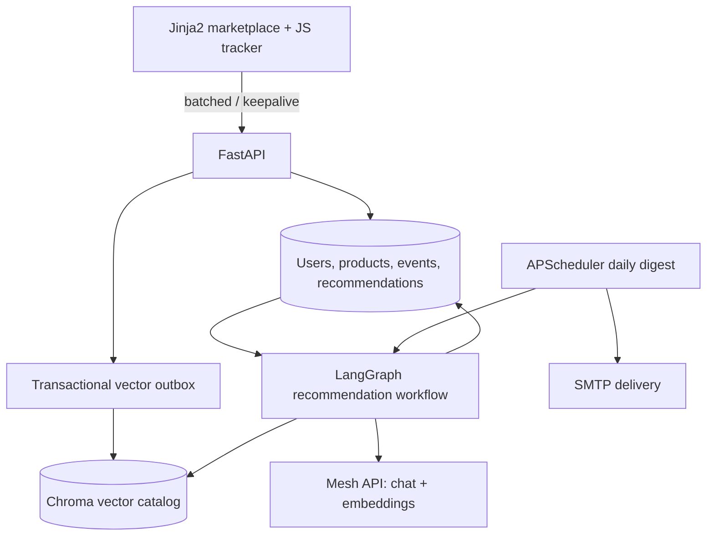
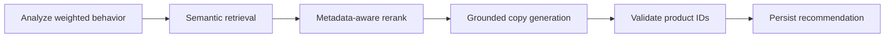

# SmartReco architecture

## Recommendation workflow

## Key production decisions

- Browser events are queued, capped at 50 per request, sent every 15 seconds and flushed with non-blocking `fetch(..., keepalive: true)` on exit. UUID idempotency prevents duplicate inserts.
- LLM refreshes require a weighted behavior threshold, a cooldown, and a changed behavior fingerprint. This prevents one-call-per-event waste.
- SQL is the source of truth. Product mutations commit with an outbox row; immediate sync gives a responsive demo, while retries repair partial vector failures.
- Retrieval is catalog-grounded. Mesh embeddings query active vectors, deterministic reranking adds category affinity, and generated IDs are validated against active SQL products.
- Behavioral evidence excludes sensitive traits. Persuasion is bounded by an explicit no-pressure/no-invented-claims prompt.

## Scaling path

Replace SQLite with PostgreSQL, Chroma with managed Qdrant/Pinecone, the in-process scheduler with Celery Beat, and the synchronous outbox worker with a queue consumer. Partition events by month/user, add retention rules, CSRF protection, rate limiting, consent controls, and OpenTelemetry/LangSmith tracing before public production use.
